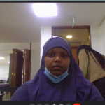

<!-- BEGIN HEADER -->

# ITalantaAcademy Kakuma 1

> - [Issues](https://github.com/iTalantaAcademy-kakuma-1/home/issues):
>   [`help-wanted`](https://github.com/iTalantaAcademy-kakuma-1/home/issues?q=is%3Aopen+label%3Ahelp-wanted),
>   [`question`](https://github.com/iTalantaAcademy-kakuma-1/home/issues?q=is%3Aopen+label%3Aquestion)
> - [Discussions](https://github.com/iTalantaAcademy-kakuma-1/home/discussions/)
> - [Deliverables](https://github.com/iTalantaAcademy-kakuma-1/home/projects/1)
> - [Random Groups](https://iTalantaAcademy-kakuma-1.github.io/home/randomizer)
>
> 

> 
Rubber Ducky

>
> 
>
>  

<!-- END HEADER -->

This repository is yours to keep track of what you've covered so far, to get to
know each other, to share helpful resources, to practice collaboration
workflows, ... to do everything!

Slack is great for chatting but links and good explanations can easily get lost
in message history. Think of this repository as your class' forum and home page.

<!-- BEGIN TOC -->

- [Class Calendar](#class-calendar)
- [Modules](#modules)
- [Students](#students)
- [Coaches](#coaches)
- Class Notes
  - [Vocabulary](./vocabulary)
    (_[PRs](https://github.com/iTalantaAcademy-kakuma-1/home/pulls?q=label%3Avocabulary)_)
  - [Snippets](./snippets)
    (_[PRs](https://github.com/iTalantaAcademy-kakuma-1/home/pulls?q=label%3Asnippets)_)
  - [Chill Zone](./chill-zone)
- HYF Links
  - [Student Guidebook](https://home.hackyourfuture.be/students)
  - [Curriculum](https://home.hackyourfuture.be/curriculum)
  - [Study Book](https://hackyourfuture.github.io/study)
  - [GitHub](https://github.com/hackyourfuturebelgium)
- [Using this Repo](#using-this-repo)

<!-- END TOC -->

---

## Class Calendar

expand/collapse

 

---

## Modules

<!-- BEGIN MODULES -->
  <ol start="1">

<li><h3><a href="https://home.hackyourfuture.be/curriculum/precourse" style="display: inline">precourse</a></h3>  <ul><li>
    0 chapters   | <a href="https://github.com/iTalantaAcademy-kakuma-1/home/projects/1?card_filter_query=label%3Adeliverable+milestone%3Aprecourse">deliverables</a>     | <a href="https://github.com/iTalantaAcademy-kakuma-1/home/milestone/1">milestone</a> | <a href="https://github.com/HackYourFutureBelgium/precourse">materials</a>  
</li></ul></li>
<li><h3><a href="https://home.hackyourfuture.be/curriculum/workflows" style="display: inline">workflows</a></h3>  <ul><li>
    2 chapters   | <a href="https://github.com/iTalantaAcademy-kakuma-1/home/projects/1?card_filter_query=label%3Adeliverable+milestone%3Aworkflows">deliverables</a>    | <a href="https://github.com/iTalantaAcademy-kakuma-1/home/issues?q=milestone%3Aworkflows+label%3Acheck-in">check-ins</a>     | <a href="https://github.com/iTalantaAcademy-kakuma-1/home/milestone/2">milestone</a> | <a href="https://github.com/HackYourFutureBelgium/workflows">materials</a>  
</li></ul></li>
<li><h3><a href="https://home.hackyourfuture.be/curriculum/agile-development" style="display: inline">agile-development</a></h3>  <ul><li>
    3 chapters   | <a href="https://github.com/iTalantaAcademy-kakuma-1/home/projects/1?card_filter_query=label%3Adeliverable+milestone%3Aagile-development">deliverables</a>    | <a href="https://github.com/iTalantaAcademy-kakuma-1/home/issues?q=milestone%3Aagile-development+label%3Acheck-in">check-ins</a>     | <a href="https://github.com/iTalantaAcademy-kakuma-1/home/milestone/3">milestone</a> | <a href="https://github.com/HackYourFutureBelgium/agile-development">materials</a>  
</li></ul></li>
<li><h3><a href="https://home.hackyourfuture.be/curriculum/ux-ui-design" style="display: inline">ux-ui-design</a></h3>  <ul><li>
    2 chapters   | <a href="https://github.com/iTalantaAcademy-kakuma-1/home/projects/1?card_filter_query=label%3Adeliverable+milestone%3Aux-ui-design">deliverables</a>    | <a href="https://github.com/iTalantaAcademy-kakuma-1/home/issues?q=milestone%3Aux-ui-design+label%3Acheck-in">check-ins</a>     | <a href="https://github.com/iTalantaAcademy-kakuma-1/home/milestone/4">milestone</a> | <a href="https://github.com/HackYourFutureBelgium/ux-ui-design">materials</a>  
</li></ul></li>
<li><h3><a href="https://home.hackyourfuture.be/curriculum/welcome-to-js" style="display: inline">welcome-to-js</a></h3>  <ul><li>
    2 chapters   | <a href="https://github.com/iTalantaAcademy-kakuma-1/home/projects/1?card_filter_query=label%3Adeliverable+milestone%3Awelcome-to-js">deliverables</a>    | <a href="https://github.com/iTalantaAcademy-kakuma-1/home/issues?q=milestone%3Awelcome-to-js+label%3Acheck-in">check-ins</a>     | <a href="https://github.com/iTalantaAcademy-kakuma-1/home/milestone/5">milestone</a> | <a href="https://github.com/HackYourFutureBelgium/welcome-to-js">materials</a>  
</li></ul></li>
<li><h3><a href="https://home.hackyourfuture.be/curriculum/debugging" style="display: inline">debugging</a></h3>  <ul><li>
    4 chapters   | <a href="https://github.com/iTalantaAcademy-kakuma-1/home/projects/1?card_filter_query=label%3Adeliverable+milestone%3Adebugging">deliverables</a>    | <a href="https://github.com/iTalantaAcademy-kakuma-1/home/issues?q=milestone%3Adebugging+label%3Acheck-in">check-ins</a>     | <a href="https://github.com/iTalantaAcademy-kakuma-1/home/milestone/6">milestone</a> | <a href="https://github.com/HackYourFutureBelgium/debugging">materials</a>  
</li></ul></li>
<li><h3><a href="https://home.hackyourfuture.be/curriculum/behavior-strategy-implementation" style="display: inline">behavior-strategy-implementation</a></h3>  <ul><li>
    3 chapters   | <a href="https://github.com/iTalantaAcademy-kakuma-1/home/projects/1?card_filter_query=label%3Adeliverable+milestone%3Abehavior-strategy-implementation">deliverables</a>    | <a href="https://github.com/iTalantaAcademy-kakuma-1/home/issues?q=milestone%3Abehavior-strategy-implementation+label%3Acheck-in">check-ins</a>     | <a href="https://github.com/iTalantaAcademy-kakuma-1/home/milestone/7">milestone</a> | <a href="https://github.com/HackYourFutureBelgium/behavior-strategy-implementation">materials</a>  
</li></ul></li>
<li><h3><a href="https://home.hackyourfuture.be/curriculum/separation-of-concerns" style="display: inline">separation-of-concerns</a></h3>  <ul><li>
    3 chapters   | <a href="https://github.com/iTalantaAcademy-kakuma-1/home/projects/1?card_filter_query=label%3Adeliverable+milestone%3Aseparation-of-concerns">deliverables</a>    | <a href="https://github.com/iTalantaAcademy-kakuma-1/home/issues?q=milestone%3Aseparation-of-concerns+label%3Acheck-in">check-ins</a>     | <a href="https://github.com/iTalantaAcademy-kakuma-1/home/milestone/8">milestone</a> | <a href="https://github.com/HackYourFutureBelgium/separation-of-concerns">materials</a>  
</li></ul></li>
<li><h3><a href="https://home.hackyourfuture.be/curriculum/architecture" style="display: inline">architecture</a></h3>  <ul><li>
    4 chapters   | <a href="https://github.com/iTalantaAcademy-kakuma-1/home/projects/1?card_filter_query=label%3Adeliverable+milestone%3Aarchitecture">deliverables</a>    | <a href="https://github.com/iTalantaAcademy-kakuma-1/home/issues?q=milestone%3Aarchitecture+label%3Acheck-in">check-ins</a>     | <a href="https://github.com/iTalantaAcademy-kakuma-1/home/milestone/9">milestone</a> | <a href="https://github.com/HackYourFutureBelgium/architecture">materials</a>  
</li></ul></li>
<li><h3><a href="https://home.hackyourfuture.be/curriculum/asynchronous-programming" style="display: inline">asynchronous-programming</a></h3>  <ul><li>
    3 chapters   | <a href="https://github.com/iTalantaAcademy-kakuma-1/home/projects/1?card_filter_query=label%3Adeliverable+milestone%3Aasynchronous-programming">deliverables</a>    | <a href="https://github.com/iTalantaAcademy-kakuma-1/home/issues?q=milestone%3Aasynchronous-programming+label%3Acheck-in">check-ins</a>     | <a href="https://github.com/iTalantaAcademy-kakuma-1/home/milestone/10">milestone</a> | <a href="https://github.com/HackYourFutureBelgium/asynchronous-programming">materials</a>  
</li></ul></li>
<li><h3><a href="https://home.hackyourfuture.be/curriculum/web-apps" style="display: inline">web-apps</a></h3>  <ul><li>
    5 chapters   | <a href="https://github.com/iTalantaAcademy-kakuma-1/home/projects/1?card_filter_query=label%3Adeliverable+milestone%3Aweb-apps">deliverables</a>    | <a href="https://github.com/iTalantaAcademy-kakuma-1/home/issues?q=milestone%3Aweb-apps+label%3Acheck-in">check-ins</a>     | <a href="https://github.com/iTalantaAcademy-kakuma-1/home/milestone/11">milestone</a> | <a href="https://github.com/HackYourFutureBelgium/web-apps">materials</a>  
</li></ul></li>
<li><h3><a href="https://home.hackyourfuture.be/curriculum/databases" style="display: inline">databases</a></h3>  <ul><li>
    2 chapters   | <a href="https://github.com/iTalantaAcademy-kakuma-1/home/projects/1?card_filter_query=label%3Adeliverable+milestone%3Adatabases">deliverables</a>    | <a href="https://github.com/iTalantaAcademy-kakuma-1/home/issues?q=milestone%3Adatabases+label%3Acheck-in">check-ins</a>     | <a href="https://github.com/iTalantaAcademy-kakuma-1/home/milestone/12">milestone</a> | <a href="https://github.com/HackYourFutureBelgium/databases">materials</a>  
</li></ul></li>
<li><h3><a href="https://home.hackyourfuture.be/curriculum/final-project" style="display: inline">final-project</a></h3>  <ul><li>
    4 chapters   | <a href="https://github.com/iTalantaAcademy-kakuma-1/home/projects/1?card_filter_query=label%3Adeliverable+milestone%3Afinal-project">deliverables</a>    | <a href="https://github.com/iTalantaAcademy-kakuma-1/home/issues?q=milestone%3Afinal-project+label%3Acheck-in">check-ins</a>     | <a href="https://github.com/iTalantaAcademy-kakuma-1/home/milestone/13">milestone</a> | <a href="https://github.com/HackYourFutureBelgium/final-project">materials</a>  
</li></ul></li>
</ol> 

[TOP](#home)

<!-- END MODULES -->

---

## Students

<!-- BEGIN STUDENTS -->
  <ul  style="list-style-type:none;">

<li><table> <tr>
  <td></td>
  <td> <h3 display="inline" id="erickaloise1997">Erick Aloise</h3>
    <ul>
       <li>about: <a href="./student-bios/erickaloise1997.md" target="_blank">bio</a>,      <a href="https://erickaloise1997.github.io">home page</a>, <a href="https://github.com/erickaloise1997">erickaloise1997</a></li>        </li>        <li>HYF: <a href="https://github.com/iTalantaAcademy-kakuma-1/home/projects/1?card_filter_query=assignee%3Aerickaloise1997">deliverables</a>, <a href="https://github.com/iTalantaAcademy-kakuma-1/home/issues?q=is%3Aissue+author%3Aerickaloise1997+label%3Acheck-in">check-ins</a>, <a href="https://github.com/iTalantaAcademy-kakuma-1/home/issues?q=is%3Aissue+commenter%3Aerickaloise1997+label%3Aroll-call">roll-calls</a></li>
        <li>issues: <a href="https://github.com/iTalantaAcademy-kakuma-1/home/issues?q=author%3Aerickaloise1997">opened</a>, <a href="https://github.com/iTalantaAcademy-kakuma-1/home/issues?q=assignee%3Aerickaloise1997+is%3Aissue">assigned</a>, <a href="https://github.com/iTalantaAcademy-kakuma-1/home/issues?q=commenter%3Aerickaloise1997">commented</a></li>
        <li>PRs: <a href="https://github.com/iTalantaAcademy-kakuma-1/home/pulls?q=author%3Aerickaloise1997">opened</a>, <a href="https://github.com/iTalantaAcademy-kakuma-1/home/pulls?q=assignee%3Aerickaloise1997+is%3Apr">assigned</a>, <a href="https://github.com/iTalantaAcademy-kakuma-1/home/pulls?q=commenter%3Aerickaloise1997">commented</a>, <a href="https://github.com/iTalantaAcademy-kakuma-1/home/pulls?q=reviewed-by%3Aerickaloise1997+is%3Apr">reviewed</a></li>
       <li>discussions: <a href="https://github.com/iTalantaAcademy-kakuma-1/home/discussions?discussions_q=author%3Aerickaloise1997">opened</a>, <a href="https://github.com/iTalantaAcademy-kakuma-1/home/discussions?discussions_q=commenter%3Aerickaloise1997">commented</a>, <a href="https://github.com/iTalantaAcademy-kakuma-1/home/discussions?discussions_q=includes%3Aerickaloise1997">included</a></li>       <li>mentions: <a href="https://github.com/iTalantaAcademy-kakuma-1/home/issues?q=mentions%3Aerickaloise1997">issues</a>, <a href="https://github.com/iTalantaAcademy-kakuma-1/home/pulls?q=mentions%3Aerickaloise1997">PRs</a>, <a href="https://github.com/iTalantaAcademy-kakuma-1/home/discussions?discussions_q=mentions%3Aerickaloise1997">discussions</a>
        <li><a href="https://github.com/iTalantaAcademy-kakuma-1/erickaloise1997">private repo</a></li>
    </ul>
  </td>
</tr></table> </li>
<li><table> <tr>
  <td></td>
  <td> <h3 display="inline" id="shukri-ibrahim">Shukri Ibrahim</h3>
    <ul>
       <li>about: <a href="./student-bios/shukri-ibrahim.md" target="_blank">bio</a>,      <a href="https://shukri-ibrahim.github.io">home page</a>, <a href="https://github.com/shukri-ibrahim">shukri-ibrahim</a></li>        </li>        <li>HYF: <a href="https://github.com/iTalantaAcademy-kakuma-1/home/projects/1?card_filter_query=assignee%3Ashukri-ibrahim">deliverables</a>, <a href="https://github.com/iTalantaAcademy-kakuma-1/home/issues?q=is%3Aissue+author%3Ashukri-ibrahim+label%3Acheck-in">check-ins</a>, <a href="https://github.com/iTalantaAcademy-kakuma-1/home/issues?q=is%3Aissue+commenter%3Ashukri-ibrahim+label%3Aroll-call">roll-calls</a></li>
        <li>issues: <a href="https://github.com/iTalantaAcademy-kakuma-1/home/issues?q=author%3Ashukri-ibrahim">opened</a>, <a href="https://github.com/iTalantaAcademy-kakuma-1/home/issues?q=assignee%3Ashukri-ibrahim+is%3Aissue">assigned</a>, <a href="https://github.com/iTalantaAcademy-kakuma-1/home/issues?q=commenter%3Ashukri-ibrahim">commented</a></li>
        <li>PRs: <a href="https://github.com/iTalantaAcademy-kakuma-1/home/pulls?q=author%3Ashukri-ibrahim">opened</a>, <a href="https://github.com/iTalantaAcademy-kakuma-1/home/pulls?q=assignee%3Ashukri-ibrahim+is%3Apr">assigned</a>, <a href="https://github.com/iTalantaAcademy-kakuma-1/home/pulls?q=commenter%3Ashukri-ibrahim">commented</a>, <a href="https://github.com/iTalantaAcademy-kakuma-1/home/pulls?q=reviewed-by%3Ashukri-ibrahim+is%3Apr">reviewed</a></li>
       <li>discussions: <a href="https://github.com/iTalantaAcademy-kakuma-1/home/discussions?discussions_q=author%3Ashukri-ibrahim">opened</a>, <a href="https://github.com/iTalantaAcademy-kakuma-1/home/discussions?discussions_q=commenter%3Ashukri-ibrahim">commented</a>, <a href="https://github.com/iTalantaAcademy-kakuma-1/home/discussions?discussions_q=includes%3Ashukri-ibrahim">included</a></li>       <li>mentions: <a href="https://github.com/iTalantaAcademy-kakuma-1/home/issues?q=mentions%3Ashukri-ibrahim">issues</a>, <a href="https://github.com/iTalantaAcademy-kakuma-1/home/pulls?q=mentions%3Ashukri-ibrahim">PRs</a>, <a href="https://github.com/iTalantaAcademy-kakuma-1/home/discussions?discussions_q=mentions%3Ashukri-ibrahim">discussions</a>
        <li><a href="https://github.com/iTalantaAcademy-kakuma-1/shukri-ibrahim">private repo</a></li>
    </ul>
  </td>
</tr></table> </li>
<li><table> <tr>
  <td></td>
  <td> <h3 display="inline" id="Elie237">Elie Bavon</h3>
    <ul>
       <li>about: <a href="./student-bios/Elie237.md" target="_blank">bio</a>,      <a href="https://Elie237.github.io">home page</a>, <a href="https://github.com/Elie237">Elie237</a></li>        </li>        <li>HYF: <a href="https://github.com/iTalantaAcademy-kakuma-1/home/projects/1?card_filter_query=assignee%3AElie237">deliverables</a>, <a href="https://github.com/iTalantaAcademy-kakuma-1/home/issues?q=is%3Aissue+author%3AElie237+label%3Acheck-in">check-ins</a>, <a href="https://github.com/iTalantaAcademy-kakuma-1/home/issues?q=is%3Aissue+commenter%3AElie237+label%3Aroll-call">roll-calls</a></li>
        <li>issues: <a href="https://github.com/iTalantaAcademy-kakuma-1/home/issues?q=author%3AElie237">opened</a>, <a href="https://github.com/iTalantaAcademy-kakuma-1/home/issues?q=assignee%3AElie237+is%3Aissue">assigned</a>, <a href="https://github.com/iTalantaAcademy-kakuma-1/home/issues?q=commenter%3AElie237">commented</a></li>
        <li>PRs: <a href="https://github.com/iTalantaAcademy-kakuma-1/home/pulls?q=author%3AElie237">opened</a>, <a href="https://github.com/iTalantaAcademy-kakuma-1/home/pulls?q=assignee%3AElie237+is%3Apr">assigned</a>, <a href="https://github.com/iTalantaAcademy-kakuma-1/home/pulls?q=commenter%3AElie237">commented</a>, <a href="https://github.com/iTalantaAcademy-kakuma-1/home/pulls?q=reviewed-by%3AElie237+is%3Apr">reviewed</a></li>
       <li>discussions: <a href="https://github.com/iTalantaAcademy-kakuma-1/home/discussions?discussions_q=author%3AElie237">opened</a>, <a href="https://github.com/iTalantaAcademy-kakuma-1/home/discussions?discussions_q=commenter%3AElie237">commented</a>, <a href="https://github.com/iTalantaAcademy-kakuma-1/home/discussions?discussions_q=includes%3AElie237">included</a></li>       <li>mentions: <a href="https://github.com/iTalantaAcademy-kakuma-1/home/issues?q=mentions%3AElie237">issues</a>, <a href="https://github.com/iTalantaAcademy-kakuma-1/home/pulls?q=mentions%3AElie237">PRs</a>, <a href="https://github.com/iTalantaAcademy-kakuma-1/home/discussions?discussions_q=mentions%3AElie237">discussions</a>
        <li><a href="https://github.com/iTalantaAcademy-kakuma-1/Elie237">private repo</a></li>
    </ul>
  </td>
</tr></table> </li>
<li><table> <tr>
  <td></td>
  <td> <h3 display="inline" id="aterchan">Chan Peter</h3>
    <ul>
       <li>about: <a href="./student-bios/aterchan.md" target="_blank">bio</a>,      <a href="https://aterchan.github.io">home page</a>, <a href="https://github.com/aterchan">aterchan</a></li>        </li>        <li>HYF: <a href="https://github.com/iTalantaAcademy-kakuma-1/home/projects/1?card_filter_query=assignee%3Aaterchan">deliverables</a>, <a href="https://github.com/iTalantaAcademy-kakuma-1/home/issues?q=is%3Aissue+author%3Aaterchan+label%3Acheck-in">check-ins</a>, <a href="https://github.com/iTalantaAcademy-kakuma-1/home/issues?q=is%3Aissue+commenter%3Aaterchan+label%3Aroll-call">roll-calls</a></li>
        <li>issues: <a href="https://github.com/iTalantaAcademy-kakuma-1/home/issues?q=author%3Aaterchan">opened</a>, <a href="https://github.com/iTalantaAcademy-kakuma-1/home/issues?q=assignee%3Aaterchan+is%3Aissue">assigned</a>, <a href="https://github.com/iTalantaAcademy-kakuma-1/home/issues?q=commenter%3Aaterchan">commented</a></li>
        <li>PRs: <a href="https://github.com/iTalantaAcademy-kakuma-1/home/pulls?q=author%3Aaterchan">opened</a>, <a href="https://github.com/iTalantaAcademy-kakuma-1/home/pulls?q=assignee%3Aaterchan+is%3Apr">assigned</a>, <a href="https://github.com/iTalantaAcademy-kakuma-1/home/pulls?q=commenter%3Aaterchan">commented</a>, <a href="https://github.com/iTalantaAcademy-kakuma-1/home/pulls?q=reviewed-by%3Aaterchan+is%3Apr">reviewed</a></li>
       <li>discussions: <a href="https://github.com/iTalantaAcademy-kakuma-1/home/discussions?discussions_q=author%3Aaterchan">opened</a>, <a href="https://github.com/iTalantaAcademy-kakuma-1/home/discussions?discussions_q=commenter%3Aaterchan">commented</a>, <a href="https://github.com/iTalantaAcademy-kakuma-1/home/discussions?discussions_q=includes%3Aaterchan">included</a></li>       <li>mentions: <a href="https://github.com/iTalantaAcademy-kakuma-1/home/issues?q=mentions%3Aaterchan">issues</a>, <a href="https://github.com/iTalantaAcademy-kakuma-1/home/pulls?q=mentions%3Aaterchan">PRs</a>, <a href="https://github.com/iTalantaAcademy-kakuma-1/home/discussions?discussions_q=mentions%3Aaterchan">discussions</a>
        <li><a href="https://github.com/iTalantaAcademy-kakuma-1/aterchan">private repo</a></li>
    </ul>
  </td>
</tr></table> </li>
<li><table> <tr>
  <td></td>
  <td> <h3 display="inline" id="faisoabdirisak">Faiso Abdirisak</h3>
    <ul>
       <li>about: <a href="./student-bios/faisoabdirisak.md" target="_blank">bio</a>,      <a href="https://faisoabdirisak.github.io">home page</a>, <a href="https://github.com/faisoabdirisak">faisoabdirisak</a></li>        </li>        <li>HYF: <a href="https://github.com/iTalantaAcademy-kakuma-1/home/projects/1?card_filter_query=assignee%3Afaisoabdirisak">deliverables</a>, <a href="https://github.com/iTalantaAcademy-kakuma-1/home/issues?q=is%3Aissue+author%3Afaisoabdirisak+label%3Acheck-in">check-ins</a>, <a href="https://github.com/iTalantaAcademy-kakuma-1/home/issues?q=is%3Aissue+commenter%3Afaisoabdirisak+label%3Aroll-call">roll-calls</a></li>
        <li>issues: <a href="https://github.com/iTalantaAcademy-kakuma-1/home/issues?q=author%3Afaisoabdirisak">opened</a>, <a href="https://github.com/iTalantaAcademy-kakuma-1/home/issues?q=assignee%3Afaisoabdirisak+is%3Aissue">assigned</a>, <a href="https://github.com/iTalantaAcademy-kakuma-1/home/issues?q=commenter%3Afaisoabdirisak">commented</a></li>
        <li>PRs: <a href="https://github.com/iTalantaAcademy-kakuma-1/home/pulls?q=author%3Afaisoabdirisak">opened</a>, <a href="https://github.com/iTalantaAcademy-kakuma-1/home/pulls?q=assignee%3Afaisoabdirisak+is%3Apr">assigned</a>, <a href="https://github.com/iTalantaAcademy-kakuma-1/home/pulls?q=commenter%3Afaisoabdirisak">commented</a>, <a href="https://github.com/iTalantaAcademy-kakuma-1/home/pulls?q=reviewed-by%3Afaisoabdirisak+is%3Apr">reviewed</a></li>
       <li>discussions: <a href="https://github.com/iTalantaAcademy-kakuma-1/home/discussions?discussions_q=author%3Afaisoabdirisak">opened</a>, <a href="https://github.com/iTalantaAcademy-kakuma-1/home/discussions?discussions_q=commenter%3Afaisoabdirisak">commented</a>, <a href="https://github.com/iTalantaAcademy-kakuma-1/home/discussions?discussions_q=includes%3Afaisoabdirisak">included</a></li>       <li>mentions: <a href="https://github.com/iTalantaAcademy-kakuma-1/home/issues?q=mentions%3Afaisoabdirisak">issues</a>, <a href="https://github.com/iTalantaAcademy-kakuma-1/home/pulls?q=mentions%3Afaisoabdirisak">PRs</a>, <a href="https://github.com/iTalantaAcademy-kakuma-1/home/discussions?discussions_q=mentions%3Afaisoabdirisak">discussions</a>
        <li><a href="https://github.com/iTalantaAcademy-kakuma-1/faisoabdirisak">private repo</a></li>
    </ul>
  </td>
</tr></table> </li>
<li><table> <tr>
  <td></td>
  <td> <h3 display="inline" id="aljabana002">Elizabeth Aljabana</h3>
    <ul>
       <li>about: <a href="./student-bios/aljabana002.md" target="_blank">bio</a>,      <a href="https://aljabana002.github.io">home page</a>, <a href="https://github.com/aljabana002">aljabana002</a></li>        </li>        <li>HYF: <a href="https://github.com/iTalantaAcademy-kakuma-1/home/projects/1?card_filter_query=assignee%3Aaljabana002">deliverables</a>, <a href="https://github.com/iTalantaAcademy-kakuma-1/home/issues?q=is%3Aissue+author%3Aaljabana002+label%3Acheck-in">check-ins</a>, <a href="https://github.com/iTalantaAcademy-kakuma-1/home/issues?q=is%3Aissue+commenter%3Aaljabana002+label%3Aroll-call">roll-calls</a></li>
        <li>issues: <a href="https://github.com/iTalantaAcademy-kakuma-1/home/issues?q=author%3Aaljabana002">opened</a>, <a href="https://github.com/iTalantaAcademy-kakuma-1/home/issues?q=assignee%3Aaljabana002+is%3Aissue">assigned</a>, <a href="https://github.com/iTalantaAcademy-kakuma-1/home/issues?q=commenter%3Aaljabana002">commented</a></li>
        <li>PRs: <a href="https://github.com/iTalantaAcademy-kakuma-1/home/pulls?q=author%3Aaljabana002">opened</a>, <a href="https://github.com/iTalantaAcademy-kakuma-1/home/pulls?q=assignee%3Aaljabana002+is%3Apr">assigned</a>, <a href="https://github.com/iTalantaAcademy-kakuma-1/home/pulls?q=commenter%3Aaljabana002">commented</a>, <a href="https://github.com/iTalantaAcademy-kakuma-1/home/pulls?q=reviewed-by%3Aaljabana002+is%3Apr">reviewed</a></li>
       <li>discussions: <a href="https://github.com/iTalantaAcademy-kakuma-1/home/discussions?discussions_q=author%3Aaljabana002">opened</a>, <a href="https://github.com/iTalantaAcademy-kakuma-1/home/discussions?discussions_q=commenter%3Aaljabana002">commented</a>, <a href="https://github.com/iTalantaAcademy-kakuma-1/home/discussions?discussions_q=includes%3Aaljabana002">included</a></li>       <li>mentions: <a href="https://github.com/iTalantaAcademy-kakuma-1/home/issues?q=mentions%3Aaljabana002">issues</a>, <a href="https://github.com/iTalantaAcademy-kakuma-1/home/pulls?q=mentions%3Aaljabana002">PRs</a>, <a href="https://github.com/iTalantaAcademy-kakuma-1/home/discussions?discussions_q=mentions%3Aaljabana002">discussions</a>
        <li><a href="https://github.com/iTalantaAcademy-kakuma-1/aljabana002">private repo</a></li>
    </ul>
  </td>
</tr></table> </li>
<li><table> <tr>
  <td></td>
  <td> <h3 display="inline" id="achiekayuen">Achiek Ayuen</h3>
    <ul>
       <li>about: <a href="./student-bios/achiekayuen.md" target="_blank">bio</a>,      <a href="https://achiekayuen.github.io">home page</a>, <a href="https://github.com/achiekayuen">achiekayuen</a></li>        </li>        <li>HYF: <a href="https://github.com/iTalantaAcademy-kakuma-1/home/projects/1?card_filter_query=assignee%3Aachiekayuen">deliverables</a>, <a href="https://github.com/iTalantaAcademy-kakuma-1/home/issues?q=is%3Aissue+author%3Aachiekayuen+label%3Acheck-in">check-ins</a>, <a href="https://github.com/iTalantaAcademy-kakuma-1/home/issues?q=is%3Aissue+commenter%3Aachiekayuen+label%3Aroll-call">roll-calls</a></li>
        <li>issues: <a href="https://github.com/iTalantaAcademy-kakuma-1/home/issues?q=author%3Aachiekayuen">opened</a>, <a href="https://github.com/iTalantaAcademy-kakuma-1/home/issues?q=assignee%3Aachiekayuen+is%3Aissue">assigned</a>, <a href="https://github.com/iTalantaAcademy-kakuma-1/home/issues?q=commenter%3Aachiekayuen">commented</a></li>
        <li>PRs: <a href="https://github.com/iTalantaAcademy-kakuma-1/home/pulls?q=author%3Aachiekayuen">opened</a>, <a href="https://github.com/iTalantaAcademy-kakuma-1/home/pulls?q=assignee%3Aachiekayuen+is%3Apr">assigned</a>, <a href="https://github.com/iTalantaAcademy-kakuma-1/home/pulls?q=commenter%3Aachiekayuen">commented</a>, <a href="https://github.com/iTalantaAcademy-kakuma-1/home/pulls?q=reviewed-by%3Aachiekayuen+is%3Apr">reviewed</a></li>
       <li>discussions: <a href="https://github.com/iTalantaAcademy-kakuma-1/home/discussions?discussions_q=author%3Aachiekayuen">opened</a>, <a href="https://github.com/iTalantaAcademy-kakuma-1/home/discussions?discussions_q=commenter%3Aachiekayuen">commented</a>, <a href="https://github.com/iTalantaAcademy-kakuma-1/home/discussions?discussions_q=includes%3Aachiekayuen">included</a></li>       <li>mentions: <a href="https://github.com/iTalantaAcademy-kakuma-1/home/issues?q=mentions%3Aachiekayuen">issues</a>, <a href="https://github.com/iTalantaAcademy-kakuma-1/home/pulls?q=mentions%3Aachiekayuen">PRs</a>, <a href="https://github.com/iTalantaAcademy-kakuma-1/home/discussions?discussions_q=mentions%3Aachiekayuen">discussions</a>
        <li><a href="https://github.com/iTalantaAcademy-kakuma-1/achiekayuen">private repo</a></li>
    </ul>
  </td>
</tr></table> </li>
<li><table> <tr>
  <td></td>
  <td> <h3 display="inline" id="lotiang">Lotiang</h3>
    <ul>
       <li>about: <a href="./student-bios/lotiang.md" target="_blank">bio</a>,      <a href="https://lotiang.github.io">home page</a>, <a href="https://github.com/lotiang">lotiang</a></li>        </li>        <li>HYF: <a href="https://github.com/iTalantaAcademy-kakuma-1/home/projects/1?card_filter_query=assignee%3Alotiang">deliverables</a>, <a href="https://github.com/iTalantaAcademy-kakuma-1/home/issues?q=is%3Aissue+author%3Alotiang+label%3Acheck-in">check-ins</a>, <a href="https://github.com/iTalantaAcademy-kakuma-1/home/issues?q=is%3Aissue+commenter%3Alotiang+label%3Aroll-call">roll-calls</a></li>
        <li>issues: <a href="https://github.com/iTalantaAcademy-kakuma-1/home/issues?q=author%3Alotiang">opened</a>, <a href="https://github.com/iTalantaAcademy-kakuma-1/home/issues?q=assignee%3Alotiang+is%3Aissue">assigned</a>, <a href="https://github.com/iTalantaAcademy-kakuma-1/home/issues?q=commenter%3Alotiang">commented</a></li>
        <li>PRs: <a href="https://github.com/iTalantaAcademy-kakuma-1/home/pulls?q=author%3Alotiang">opened</a>, <a href="https://github.com/iTalantaAcademy-kakuma-1/home/pulls?q=assignee%3Alotiang+is%3Apr">assigned</a>, <a href="https://github.com/iTalantaAcademy-kakuma-1/home/pulls?q=commenter%3Alotiang">commented</a>, <a href="https://github.com/iTalantaAcademy-kakuma-1/home/pulls?q=reviewed-by%3Alotiang+is%3Apr">reviewed</a></li>
       <li>discussions: <a href="https://github.com/iTalantaAcademy-kakuma-1/home/discussions?discussions_q=author%3Alotiang">opened</a>, <a href="https://github.com/iTalantaAcademy-kakuma-1/home/discussions?discussions_q=commenter%3Alotiang">commented</a>, <a href="https://github.com/iTalantaAcademy-kakuma-1/home/discussions?discussions_q=includes%3Alotiang">included</a></li>       <li>mentions: <a href="https://github.com/iTalantaAcademy-kakuma-1/home/issues?q=mentions%3Alotiang">issues</a>, <a href="https://github.com/iTalantaAcademy-kakuma-1/home/pulls?q=mentions%3Alotiang">PRs</a>, <a href="https://github.com/iTalantaAcademy-kakuma-1/home/discussions?discussions_q=mentions%3Alotiang">discussions</a>
        <li><a href="https://github.com/iTalantaAcademy-kakuma-1/lotiang">private repo</a></li>
    </ul>
  </td>
</tr></table> </li>
<li><table> <tr>
  <td></td>
  <td> <h3 display="inline" id="chuoltiap">Chuol Tiap</h3>
    <ul>
       <li>about: <a href="./student-bios/chuoltiap.md" target="_blank">bio</a>,      <a href="https://chuoltiap.github.io">home page</a>, <a href="https://github.com/chuoltiap">chuoltiap</a></li>        </li>        <li>HYF: <a href="https://github.com/iTalantaAcademy-kakuma-1/home/projects/1?card_filter_query=assignee%3Achuoltiap">deliverables</a>, <a href="https://github.com/iTalantaAcademy-kakuma-1/home/issues?q=is%3Aissue+author%3Achuoltiap+label%3Acheck-in">check-ins</a>, <a href="https://github.com/iTalantaAcademy-kakuma-1/home/issues?q=is%3Aissue+commenter%3Achuoltiap+label%3Aroll-call">roll-calls</a></li>
        <li>issues: <a href="https://github.com/iTalantaAcademy-kakuma-1/home/issues?q=author%3Achuoltiap">opened</a>, <a href="https://github.com/iTalantaAcademy-kakuma-1/home/issues?q=assignee%3Achuoltiap+is%3Aissue">assigned</a>, <a href="https://github.com/iTalantaAcademy-kakuma-1/home/issues?q=commenter%3Achuoltiap">commented</a></li>
        <li>PRs: <a href="https://github.com/iTalantaAcademy-kakuma-1/home/pulls?q=author%3Achuoltiap">opened</a>, <a href="https://github.com/iTalantaAcademy-kakuma-1/home/pulls?q=assignee%3Achuoltiap+is%3Apr">assigned</a>, <a href="https://github.com/iTalantaAcademy-kakuma-1/home/pulls?q=commenter%3Achuoltiap">commented</a>, <a href="https://github.com/iTalantaAcademy-kakuma-1/home/pulls?q=reviewed-by%3Achuoltiap+is%3Apr">reviewed</a></li>
       <li>discussions: <a href="https://github.com/iTalantaAcademy-kakuma-1/home/discussions?discussions_q=author%3Achuoltiap">opened</a>, <a href="https://github.com/iTalantaAcademy-kakuma-1/home/discussions?discussions_q=commenter%3Achuoltiap">commented</a>, <a href="https://github.com/iTalantaAcademy-kakuma-1/home/discussions?discussions_q=includes%3Achuoltiap">included</a></li>       <li>mentions: <a href="https://github.com/iTalantaAcademy-kakuma-1/home/issues?q=mentions%3Achuoltiap">issues</a>, <a href="https://github.com/iTalantaAcademy-kakuma-1/home/pulls?q=mentions%3Achuoltiap">PRs</a>, <a href="https://github.com/iTalantaAcademy-kakuma-1/home/discussions?discussions_q=mentions%3Achuoltiap">discussions</a>
        <li><a href="https://github.com/iTalantaAcademy-kakuma-1/chuoltiap">private repo</a></li>
    </ul>
  </td>
</tr></table> </li>
<li><table> <tr>
  <td></td>
  <td> <h3 display="inline" id="ekai25">Ekai Lopiskou</h3>
    <ul>
       <li>about: <a href="./student-bios/ekai25.md" target="_blank">bio</a>,      <a href="https://ekai25.github.io">home page</a>, <a href="https://github.com/ekai25">ekai25</a></li>        </li>        <li>HYF: <a href="https://github.com/iTalantaAcademy-kakuma-1/home/projects/1?card_filter_query=assignee%3Aekai25">deliverables</a>, <a href="https://github.com/iTalantaAcademy-kakuma-1/home/issues?q=is%3Aissue+author%3Aekai25+label%3Acheck-in">check-ins</a>, <a href="https://github.com/iTalantaAcademy-kakuma-1/home/issues?q=is%3Aissue+commenter%3Aekai25+label%3Aroll-call">roll-calls</a></li>
        <li>issues: <a href="https://github.com/iTalantaAcademy-kakuma-1/home/issues?q=author%3Aekai25">opened</a>, <a href="https://github.com/iTalantaAcademy-kakuma-1/home/issues?q=assignee%3Aekai25+is%3Aissue">assigned</a>, <a href="https://github.com/iTalantaAcademy-kakuma-1/home/issues?q=commenter%3Aekai25">commented</a></li>
        <li>PRs: <a href="https://github.com/iTalantaAcademy-kakuma-1/home/pulls?q=author%3Aekai25">opened</a>, <a href="https://github.com/iTalantaAcademy-kakuma-1/home/pulls?q=assignee%3Aekai25+is%3Apr">assigned</a>, <a href="https://github.com/iTalantaAcademy-kakuma-1/home/pulls?q=commenter%3Aekai25">commented</a>, <a href="https://github.com/iTalantaAcademy-kakuma-1/home/pulls?q=reviewed-by%3Aekai25+is%3Apr">reviewed</a></li>
       <li>discussions: <a href="https://github.com/iTalantaAcademy-kakuma-1/home/discussions?discussions_q=author%3Aekai25">opened</a>, <a href="https://github.com/iTalantaAcademy-kakuma-1/home/discussions?discussions_q=commenter%3Aekai25">commented</a>, <a href="https://github.com/iTalantaAcademy-kakuma-1/home/discussions?discussions_q=includes%3Aekai25">included</a></li>       <li>mentions: <a href="https://github.com/iTalantaAcademy-kakuma-1/home/issues?q=mentions%3Aekai25">issues</a>, <a href="https://github.com/iTalantaAcademy-kakuma-1/home/pulls?q=mentions%3Aekai25">PRs</a>, <a href="https://github.com/iTalantaAcademy-kakuma-1/home/discussions?discussions_q=mentions%3Aekai25">discussions</a>
        <li><a href="https://github.com/iTalantaAcademy-kakuma-1/ekai25">private repo</a></li>
    </ul>
  </td>
</tr></table> </li>
<li><table> <tr>
  <td></td>
  <td> <h3 display="inline" id="Kuol18">Samuel Kuol</h3>
    <ul>
       <li>about: <a href="./student-bios/Kuol18.md" target="_blank">bio</a>,      <a href="https://Kuol18.github.io">home page</a>, <a href="https://github.com/Kuol18">Kuol18</a></li>        </li>        <li>HYF: <a href="https://github.com/iTalantaAcademy-kakuma-1/home/projects/1?card_filter_query=assignee%3AKuol18">deliverables</a>, <a href="https://github.com/iTalantaAcademy-kakuma-1/home/issues?q=is%3Aissue+author%3AKuol18+label%3Acheck-in">check-ins</a>, <a href="https://github.com/iTalantaAcademy-kakuma-1/home/issues?q=is%3Aissue+commenter%3AKuol18+label%3Aroll-call">roll-calls</a></li>
        <li>issues: <a href="https://github.com/iTalantaAcademy-kakuma-1/home/issues?q=author%3AKuol18">opened</a>, <a href="https://github.com/iTalantaAcademy-kakuma-1/home/issues?q=assignee%3AKuol18+is%3Aissue">assigned</a>, <a href="https://github.com/iTalantaAcademy-kakuma-1/home/issues?q=commenter%3AKuol18">commented</a></li>
        <li>PRs: <a href="https://github.com/iTalantaAcademy-kakuma-1/home/pulls?q=author%3AKuol18">opened</a>, <a href="https://github.com/iTalantaAcademy-kakuma-1/home/pulls?q=assignee%3AKuol18+is%3Apr">assigned</a>, <a href="https://github.com/iTalantaAcademy-kakuma-1/home/pulls?q=commenter%3AKuol18">commented</a>, <a href="https://github.com/iTalantaAcademy-kakuma-1/home/pulls?q=reviewed-by%3AKuol18+is%3Apr">reviewed</a></li>
       <li>discussions: <a href="https://github.com/iTalantaAcademy-kakuma-1/home/discussions?discussions_q=author%3AKuol18">opened</a>, <a href="https://github.com/iTalantaAcademy-kakuma-1/home/discussions?discussions_q=commenter%3AKuol18">commented</a>, <a href="https://github.com/iTalantaAcademy-kakuma-1/home/discussions?discussions_q=includes%3AKuol18">included</a></li>       <li>mentions: <a href="https://github.com/iTalantaAcademy-kakuma-1/home/issues?q=mentions%3AKuol18">issues</a>, <a href="https://github.com/iTalantaAcademy-kakuma-1/home/pulls?q=mentions%3AKuol18">PRs</a>, <a href="https://github.com/iTalantaAcademy-kakuma-1/home/discussions?discussions_q=mentions%3AKuol18">discussions</a>
        <li><a href="https://github.com/iTalantaAcademy-kakuma-1/Kuol18">private repo</a></li>
    </ul>
  </td>
</tr></table> </li>
<li><table> <tr>
  <td></td>
  <td> <h3 display="inline" id="MahdiAdam">Mahdi Adam</h3>
    <ul>
       <li>about: <a href="./student-bios/MahdiAdam.md" target="_blank">bio</a>,      <a href="https://MahdiAdam.github.io">home page</a>, <a href="https://github.com/MahdiAdam">MahdiAdam</a></li>        </li>        <li>HYF: <a href="https://github.com/iTalantaAcademy-kakuma-1/home/projects/1?card_filter_query=assignee%3AMahdiAdam">deliverables</a>, <a href="https://github.com/iTalantaAcademy-kakuma-1/home/issues?q=is%3Aissue+author%3AMahdiAdam+label%3Acheck-in">check-ins</a>, <a href="https://github.com/iTalantaAcademy-kakuma-1/home/issues?q=is%3Aissue+commenter%3AMahdiAdam+label%3Aroll-call">roll-calls</a></li>
        <li>issues: <a href="https://github.com/iTalantaAcademy-kakuma-1/home/issues?q=author%3AMahdiAdam">opened</a>, <a href="https://github.com/iTalantaAcademy-kakuma-1/home/issues?q=assignee%3AMahdiAdam+is%3Aissue">assigned</a>, <a href="https://github.com/iTalantaAcademy-kakuma-1/home/issues?q=commenter%3AMahdiAdam">commented</a></li>
        <li>PRs: <a href="https://github.com/iTalantaAcademy-kakuma-1/home/pulls?q=author%3AMahdiAdam">opened</a>, <a href="https://github.com/iTalantaAcademy-kakuma-1/home/pulls?q=assignee%3AMahdiAdam+is%3Apr">assigned</a>, <a href="https://github.com/iTalantaAcademy-kakuma-1/home/pulls?q=commenter%3AMahdiAdam">commented</a>, <a href="https://github.com/iTalantaAcademy-kakuma-1/home/pulls?q=reviewed-by%3AMahdiAdam+is%3Apr">reviewed</a></li>
       <li>discussions: <a href="https://github.com/iTalantaAcademy-kakuma-1/home/discussions?discussions_q=author%3AMahdiAdam">opened</a>, <a href="https://github.com/iTalantaAcademy-kakuma-1/home/discussions?discussions_q=commenter%3AMahdiAdam">commented</a>, <a href="https://github.com/iTalantaAcademy-kakuma-1/home/discussions?discussions_q=includes%3AMahdiAdam">included</a></li>       <li>mentions: <a href="https://github.com/iTalantaAcademy-kakuma-1/home/issues?q=mentions%3AMahdiAdam">issues</a>, <a href="https://github.com/iTalantaAcademy-kakuma-1/home/pulls?q=mentions%3AMahdiAdam">PRs</a>, <a href="https://github.com/iTalantaAcademy-kakuma-1/home/discussions?discussions_q=mentions%3AMahdiAdam">discussions</a>
        <li><a href="https://github.com/iTalantaAcademy-kakuma-1/MahdiAdam">private repo</a></li>
    </ul>
  </td>
</tr></table> </li>
<li><table> <tr>
  <td></td>
  <td> <h3 display="inline" id="wazir-babikir">Babikir Baballa</h3>
    <ul>
       <li>about: <a href="./student-bios/wazir-babikir.md" target="_blank">bio</a>,      <a href="https://wazir-babikir.github.io">home page</a>, <a href="https://github.com/wazir-babikir">wazir-babikir</a></li>        </li>        <li>HYF: <a href="https://github.com/iTalantaAcademy-kakuma-1/home/projects/1?card_filter_query=assignee%3Awazir-babikir">deliverables</a>, <a href="https://github.com/iTalantaAcademy-kakuma-1/home/issues?q=is%3Aissue+author%3Awazir-babikir+label%3Acheck-in">check-ins</a>, <a href="https://github.com/iTalantaAcademy-kakuma-1/home/issues?q=is%3Aissue+commenter%3Awazir-babikir+label%3Aroll-call">roll-calls</a></li>
        <li>issues: <a href="https://github.com/iTalantaAcademy-kakuma-1/home/issues?q=author%3Awazir-babikir">opened</a>, <a href="https://github.com/iTalantaAcademy-kakuma-1/home/issues?q=assignee%3Awazir-babikir+is%3Aissue">assigned</a>, <a href="https://github.com/iTalantaAcademy-kakuma-1/home/issues?q=commenter%3Awazir-babikir">commented</a></li>
        <li>PRs: <a href="https://github.com/iTalantaAcademy-kakuma-1/home/pulls?q=author%3Awazir-babikir">opened</a>, <a href="https://github.com/iTalantaAcademy-kakuma-1/home/pulls?q=assignee%3Awazir-babikir+is%3Apr">assigned</a>, <a href="https://github.com/iTalantaAcademy-kakuma-1/home/pulls?q=commenter%3Awazir-babikir">commented</a>, <a href="https://github.com/iTalantaAcademy-kakuma-1/home/pulls?q=reviewed-by%3Awazir-babikir+is%3Apr">reviewed</a></li>
       <li>discussions: <a href="https://github.com/iTalantaAcademy-kakuma-1/home/discussions?discussions_q=author%3Awazir-babikir">opened</a>, <a href="https://github.com/iTalantaAcademy-kakuma-1/home/discussions?discussions_q=commenter%3Awazir-babikir">commented</a>, <a href="https://github.com/iTalantaAcademy-kakuma-1/home/discussions?discussions_q=includes%3Awazir-babikir">included</a></li>       <li>mentions: <a href="https://github.com/iTalantaAcademy-kakuma-1/home/issues?q=mentions%3Awazir-babikir">issues</a>, <a href="https://github.com/iTalantaAcademy-kakuma-1/home/pulls?q=mentions%3Awazir-babikir">PRs</a>, <a href="https://github.com/iTalantaAcademy-kakuma-1/home/discussions?discussions_q=mentions%3Awazir-babikir">discussions</a>
        <li><a href="https://github.com/iTalantaAcademy-kakuma-1/wazir-babikir">private repo</a></li>
    </ul>
  </td>
</tr></table> </li>
<li><table> <tr>
  <td></td>
  <td> <h3 display="inline" id="ahmedmohamud">Ahmed Mohamud</h3>
    <ul>
       <li>about: <a href="./student-bios/ahmedmohamud.md" target="_blank">bio</a>,      <a href="https://ahmedmohamud.github.io">home page</a>, <a href="https://github.com/ahmedmohamud">ahmedmohamud</a></li>        </li>        <li>HYF: <a href="https://github.com/iTalantaAcademy-kakuma-1/home/projects/1?card_filter_query=assignee%3Aahmedmohamud">deliverables</a>, <a href="https://github.com/iTalantaAcademy-kakuma-1/home/issues?q=is%3Aissue+author%3Aahmedmohamud+label%3Acheck-in">check-ins</a>, <a href="https://github.com/iTalantaAcademy-kakuma-1/home/issues?q=is%3Aissue+commenter%3Aahmedmohamud+label%3Aroll-call">roll-calls</a></li>
        <li>issues: <a href="https://github.com/iTalantaAcademy-kakuma-1/home/issues?q=author%3Aahmedmohamud">opened</a>, <a href="https://github.com/iTalantaAcademy-kakuma-1/home/issues?q=assignee%3Aahmedmohamud+is%3Aissue">assigned</a>, <a href="https://github.com/iTalantaAcademy-kakuma-1/home/issues?q=commenter%3Aahmedmohamud">commented</a></li>
        <li>PRs: <a href="https://github.com/iTalantaAcademy-kakuma-1/home/pulls?q=author%3Aahmedmohamud">opened</a>, <a href="https://github.com/iTalantaAcademy-kakuma-1/home/pulls?q=assignee%3Aahmedmohamud+is%3Apr">assigned</a>, <a href="https://github.com/iTalantaAcademy-kakuma-1/home/pulls?q=commenter%3Aahmedmohamud">commented</a>, <a href="https://github.com/iTalantaAcademy-kakuma-1/home/pulls?q=reviewed-by%3Aahmedmohamud+is%3Apr">reviewed</a></li>
       <li>discussions: <a href="https://github.com/iTalantaAcademy-kakuma-1/home/discussions?discussions_q=author%3Aahmedmohamud">opened</a>, <a href="https://github.com/iTalantaAcademy-kakuma-1/home/discussions?discussions_q=commenter%3Aahmedmohamud">commented</a>, <a href="https://github.com/iTalantaAcademy-kakuma-1/home/discussions?discussions_q=includes%3Aahmedmohamud">included</a></li>       <li>mentions: <a href="https://github.com/iTalantaAcademy-kakuma-1/home/issues?q=mentions%3Aahmedmohamud">issues</a>, <a href="https://github.com/iTalantaAcademy-kakuma-1/home/pulls?q=mentions%3Aahmedmohamud">PRs</a>, <a href="https://github.com/iTalantaAcademy-kakuma-1/home/discussions?discussions_q=mentions%3Aahmedmohamud">discussions</a>
        <li><a href="https://github.com/iTalantaAcademy-kakuma-1/ahmedmohamud">private repo</a></li>
    </ul>
  </td>
</tr></table> </li>
<li><table> <tr>
  <td></td>
  <td> <h3 display="inline" id="kdessaik">Dessai Kibeho</h3>
    <ul>
       <li>about: <a href="./student-bios/kdessaik.md" target="_blank">bio</a>,      <a href="https://kdessaik.github.io">home page</a>, <a href="https://github.com/kdessaik">kdessaik</a></li>        </li>        <li>HYF: <a href="https://github.com/iTalantaAcademy-kakuma-1/home/projects/1?card_filter_query=assignee%3Akdessaik">deliverables</a>, <a href="https://github.com/iTalantaAcademy-kakuma-1/home/issues?q=is%3Aissue+author%3Akdessaik+label%3Acheck-in">check-ins</a>, <a href="https://github.com/iTalantaAcademy-kakuma-1/home/issues?q=is%3Aissue+commenter%3Akdessaik+label%3Aroll-call">roll-calls</a></li>
        <li>issues: <a href="https://github.com/iTalantaAcademy-kakuma-1/home/issues?q=author%3Akdessaik">opened</a>, <a href="https://github.com/iTalantaAcademy-kakuma-1/home/issues?q=assignee%3Akdessaik+is%3Aissue">assigned</a>, <a href="https://github.com/iTalantaAcademy-kakuma-1/home/issues?q=commenter%3Akdessaik">commented</a></li>
        <li>PRs: <a href="https://github.com/iTalantaAcademy-kakuma-1/home/pulls?q=author%3Akdessaik">opened</a>, <a href="https://github.com/iTalantaAcademy-kakuma-1/home/pulls?q=assignee%3Akdessaik+is%3Apr">assigned</a>, <a href="https://github.com/iTalantaAcademy-kakuma-1/home/pulls?q=commenter%3Akdessaik">commented</a>, <a href="https://github.com/iTalantaAcademy-kakuma-1/home/pulls?q=reviewed-by%3Akdessaik+is%3Apr">reviewed</a></li>
       <li>discussions: <a href="https://github.com/iTalantaAcademy-kakuma-1/home/discussions?discussions_q=author%3Akdessaik">opened</a>, <a href="https://github.com/iTalantaAcademy-kakuma-1/home/discussions?discussions_q=commenter%3Akdessaik">commented</a>, <a href="https://github.com/iTalantaAcademy-kakuma-1/home/discussions?discussions_q=includes%3Akdessaik">included</a></li>       <li>mentions: <a href="https://github.com/iTalantaAcademy-kakuma-1/home/issues?q=mentions%3Akdessaik">issues</a>, <a href="https://github.com/iTalantaAcademy-kakuma-1/home/pulls?q=mentions%3Akdessaik">PRs</a>, <a href="https://github.com/iTalantaAcademy-kakuma-1/home/discussions?discussions_q=mentions%3Akdessaik">discussions</a>
        <li><a href="https://github.com/iTalantaAcademy-kakuma-1/kdessaik">private repo</a></li>
    </ul>
  </td>
</tr></table> </li>
<li><table> <tr>
  <td></td>
  <td> <h3 display="inline" id="franco9535">Franco Ohisa</h3>
    <ul>
       <li>about: <a href="./student-bios/franco9535.md" target="_blank">bio</a>,      <a href="https://franco9535.github.io">home page</a>, <a href="https://github.com/franco9535">franco9535</a></li>        </li>        <li>HYF: <a href="https://github.com/iTalantaAcademy-kakuma-1/home/projects/1?card_filter_query=assignee%3Afranco9535">deliverables</a>, <a href="https://github.com/iTalantaAcademy-kakuma-1/home/issues?q=is%3Aissue+author%3Afranco9535+label%3Acheck-in">check-ins</a>, <a href="https://github.com/iTalantaAcademy-kakuma-1/home/issues?q=is%3Aissue+commenter%3Afranco9535+label%3Aroll-call">roll-calls</a></li>
        <li>issues: <a href="https://github.com/iTalantaAcademy-kakuma-1/home/issues?q=author%3Afranco9535">opened</a>, <a href="https://github.com/iTalantaAcademy-kakuma-1/home/issues?q=assignee%3Afranco9535+is%3Aissue">assigned</a>, <a href="https://github.com/iTalantaAcademy-kakuma-1/home/issues?q=commenter%3Afranco9535">commented</a></li>
        <li>PRs: <a href="https://github.com/iTalantaAcademy-kakuma-1/home/pulls?q=author%3Afranco9535">opened</a>, <a href="https://github.com/iTalantaAcademy-kakuma-1/home/pulls?q=assignee%3Afranco9535+is%3Apr">assigned</a>, <a href="https://github.com/iTalantaAcademy-kakuma-1/home/pulls?q=commenter%3Afranco9535">commented</a>, <a href="https://github.com/iTalantaAcademy-kakuma-1/home/pulls?q=reviewed-by%3Afranco9535+is%3Apr">reviewed</a></li>
       <li>discussions: <a href="https://github.com/iTalantaAcademy-kakuma-1/home/discussions?discussions_q=author%3Afranco9535">opened</a>, <a href="https://github.com/iTalantaAcademy-kakuma-1/home/discussions?discussions_q=commenter%3Afranco9535">commented</a>, <a href="https://github.com/iTalantaAcademy-kakuma-1/home/discussions?discussions_q=includes%3Afranco9535">included</a></li>       <li>mentions: <a href="https://github.com/iTalantaAcademy-kakuma-1/home/issues?q=mentions%3Afranco9535">issues</a>, <a href="https://github.com/iTalantaAcademy-kakuma-1/home/pulls?q=mentions%3Afranco9535">PRs</a>, <a href="https://github.com/iTalantaAcademy-kakuma-1/home/discussions?discussions_q=mentions%3Afranco9535">discussions</a>
        <li><a href="https://github.com/iTalantaAcademy-kakuma-1/franco9535">private repo</a></li>
    </ul>
  </td>
</tr></table> </li>
<li><table> <tr>
  <td></td>
  <td> <h3 display="inline" id="erot-sammy">Sammy Erot</h3>
    <ul>
       <li>about: <a href="./student-bios/erot-sammy.md" target="_blank">bio</a>,      <a href="https://erot-sammy.github.io">home page</a>, <a href="https://github.com/erot-sammy">erot-sammy</a></li>        </li>        <li>HYF: <a href="https://github.com/iTalantaAcademy-kakuma-1/home/projects/1?card_filter_query=assignee%3Aerot-sammy">deliverables</a>, <a href="https://github.com/iTalantaAcademy-kakuma-1/home/issues?q=is%3Aissue+author%3Aerot-sammy+label%3Acheck-in">check-ins</a>, <a href="https://github.com/iTalantaAcademy-kakuma-1/home/issues?q=is%3Aissue+commenter%3Aerot-sammy+label%3Aroll-call">roll-calls</a></li>
        <li>issues: <a href="https://github.com/iTalantaAcademy-kakuma-1/home/issues?q=author%3Aerot-sammy">opened</a>, <a href="https://github.com/iTalantaAcademy-kakuma-1/home/issues?q=assignee%3Aerot-sammy+is%3Aissue">assigned</a>, <a href="https://github.com/iTalantaAcademy-kakuma-1/home/issues?q=commenter%3Aerot-sammy">commented</a></li>
        <li>PRs: <a href="https://github.com/iTalantaAcademy-kakuma-1/home/pulls?q=author%3Aerot-sammy">opened</a>, <a href="https://github.com/iTalantaAcademy-kakuma-1/home/pulls?q=assignee%3Aerot-sammy+is%3Apr">assigned</a>, <a href="https://github.com/iTalantaAcademy-kakuma-1/home/pulls?q=commenter%3Aerot-sammy">commented</a>, <a href="https://github.com/iTalantaAcademy-kakuma-1/home/pulls?q=reviewed-by%3Aerot-sammy+is%3Apr">reviewed</a></li>
       <li>discussions: <a href="https://github.com/iTalantaAcademy-kakuma-1/home/discussions?discussions_q=author%3Aerot-sammy">opened</a>, <a href="https://github.com/iTalantaAcademy-kakuma-1/home/discussions?discussions_q=commenter%3Aerot-sammy">commented</a>, <a href="https://github.com/iTalantaAcademy-kakuma-1/home/discussions?discussions_q=includes%3Aerot-sammy">included</a></li>       <li>mentions: <a href="https://github.com/iTalantaAcademy-kakuma-1/home/issues?q=mentions%3Aerot-sammy">issues</a>, <a href="https://github.com/iTalantaAcademy-kakuma-1/home/pulls?q=mentions%3Aerot-sammy">PRs</a>, <a href="https://github.com/iTalantaAcademy-kakuma-1/home/discussions?discussions_q=mentions%3Aerot-sammy">discussions</a>
        <li><a href="https://github.com/iTalantaAcademy-kakuma-1/erot-sammy">private repo</a></li>
    </ul>
  </td>
</tr></table> </li>
<li><table> <tr>
  <td></td>
  <td> <h3 display="inline" id="abriyusif">Abri Yusif</h3>
    <ul>
       <li>about: <a href="./student-bios/abriyusif.md" target="_blank">bio</a>,      <a href="https://abriyusif.github.io">home page</a>, <a href="https://github.com/abriyusif">abriyusif</a></li>        </li>        <li>HYF: <a href="https://github.com/iTalantaAcademy-kakuma-1/home/projects/1?card_filter_query=assignee%3Aabriyusif">deliverables</a>, <a href="https://github.com/iTalantaAcademy-kakuma-1/home/issues?q=is%3Aissue+author%3Aabriyusif+label%3Acheck-in">check-ins</a>, <a href="https://github.com/iTalantaAcademy-kakuma-1/home/issues?q=is%3Aissue+commenter%3Aabriyusif+label%3Aroll-call">roll-calls</a></li>
        <li>issues: <a href="https://github.com/iTalantaAcademy-kakuma-1/home/issues?q=author%3Aabriyusif">opened</a>, <a href="https://github.com/iTalantaAcademy-kakuma-1/home/issues?q=assignee%3Aabriyusif+is%3Aissue">assigned</a>, <a href="https://github.com/iTalantaAcademy-kakuma-1/home/issues?q=commenter%3Aabriyusif">commented</a></li>
        <li>PRs: <a href="https://github.com/iTalantaAcademy-kakuma-1/home/pulls?q=author%3Aabriyusif">opened</a>, <a href="https://github.com/iTalantaAcademy-kakuma-1/home/pulls?q=assignee%3Aabriyusif+is%3Apr">assigned</a>, <a href="https://github.com/iTalantaAcademy-kakuma-1/home/pulls?q=commenter%3Aabriyusif">commented</a>, <a href="https://github.com/iTalantaAcademy-kakuma-1/home/pulls?q=reviewed-by%3Aabriyusif+is%3Apr">reviewed</a></li>
       <li>discussions: <a href="https://github.com/iTalantaAcademy-kakuma-1/home/discussions?discussions_q=author%3Aabriyusif">opened</a>, <a href="https://github.com/iTalantaAcademy-kakuma-1/home/discussions?discussions_q=commenter%3Aabriyusif">commented</a>, <a href="https://github.com/iTalantaAcademy-kakuma-1/home/discussions?discussions_q=includes%3Aabriyusif">included</a></li>       <li>mentions: <a href="https://github.com/iTalantaAcademy-kakuma-1/home/issues?q=mentions%3Aabriyusif">issues</a>, <a href="https://github.com/iTalantaAcademy-kakuma-1/home/pulls?q=mentions%3Aabriyusif">PRs</a>, <a href="https://github.com/iTalantaAcademy-kakuma-1/home/discussions?discussions_q=mentions%3Aabriyusif">discussions</a>
        <li><a href="https://github.com/iTalantaAcademy-kakuma-1/abriyusif">private repo</a></li>
    </ul>
  </td>
</tr></table> </li>
<li><table> <tr>
  <td></td>
  <td> <h3 display="inline" id="angathanga7878ochalla">Angathanga Ochalla</h3>
    <ul>
       <li>about: <a href="./student-bios/angathanga7878ochalla.md" target="_blank">bio</a>,      <a href="https://angathanga7878ochalla.github.io">home page</a>, <a href="https://github.com/angathanga7878ochalla">angathanga7878ochalla</a></li>        </li>        <li>HYF: <a href="https://github.com/iTalantaAcademy-kakuma-1/home/projects/1?card_filter_query=assignee%3Aangathanga7878ochalla">deliverables</a>, <a href="https://github.com/iTalantaAcademy-kakuma-1/home/issues?q=is%3Aissue+author%3Aangathanga7878ochalla+label%3Acheck-in">check-ins</a>, <a href="https://github.com/iTalantaAcademy-kakuma-1/home/issues?q=is%3Aissue+commenter%3Aangathanga7878ochalla+label%3Aroll-call">roll-calls</a></li>
        <li>issues: <a href="https://github.com/iTalantaAcademy-kakuma-1/home/issues?q=author%3Aangathanga7878ochalla">opened</a>, <a href="https://github.com/iTalantaAcademy-kakuma-1/home/issues?q=assignee%3Aangathanga7878ochalla+is%3Aissue">assigned</a>, <a href="https://github.com/iTalantaAcademy-kakuma-1/home/issues?q=commenter%3Aangathanga7878ochalla">commented</a></li>
        <li>PRs: <a href="https://github.com/iTalantaAcademy-kakuma-1/home/pulls?q=author%3Aangathanga7878ochalla">opened</a>, <a href="https://github.com/iTalantaAcademy-kakuma-1/home/pulls?q=assignee%3Aangathanga7878ochalla+is%3Apr">assigned</a>, <a href="https://github.com/iTalantaAcademy-kakuma-1/home/pulls?q=commenter%3Aangathanga7878ochalla">commented</a>, <a href="https://github.com/iTalantaAcademy-kakuma-1/home/pulls?q=reviewed-by%3Aangathanga7878ochalla+is%3Apr">reviewed</a></li>
       <li>discussions: <a href="https://github.com/iTalantaAcademy-kakuma-1/home/discussions?discussions_q=author%3Aangathanga7878ochalla">opened</a>, <a href="https://github.com/iTalantaAcademy-kakuma-1/home/discussions?discussions_q=commenter%3Aangathanga7878ochalla">commented</a>, <a href="https://github.com/iTalantaAcademy-kakuma-1/home/discussions?discussions_q=includes%3Aangathanga7878ochalla">included</a></li>       <li>mentions: <a href="https://github.com/iTalantaAcademy-kakuma-1/home/issues?q=mentions%3Aangathanga7878ochalla">issues</a>, <a href="https://github.com/iTalantaAcademy-kakuma-1/home/pulls?q=mentions%3Aangathanga7878ochalla">PRs</a>, <a href="https://github.com/iTalantaAcademy-kakuma-1/home/discussions?discussions_q=mentions%3Aangathanga7878ochalla">discussions</a>
        <li><a href="https://github.com/iTalantaAcademy-kakuma-1/angathanga7878ochalla">private repo</a></li>
    </ul>
  </td>
</tr></table> </li>
</ul> 

[TOP](#home)

<!-- END STUDENTS -->

---

## Coaches

<!-- END COACHES -->

---

## Using this Repo

Here are 5 tips for using issues in this repository:

### Help Wanted

- **The Template**: If you're blocked on something in an assignment or
  self-study you can use the `help-wanted` template to create a new issue and
  ask for help.
- **The Label**: You can attach the `help-wanted` label to any issue or PR that
  you need help completing. If the code you are blocked on is in another
  repository, you can create a new issue using the `help-wanted` template to
  describe your problem and link to your code.

### Question

- **The Template** Got a question about anything? Go ahead and ask! You can use
  create a new issue using the `question` template to ask your question in a
  clear and structured way.
- **The Label**: Or add the `question` label to any other issue! This can help
  be helpful for searching check-ins or deliverables.

### Check-Ins

> template + label

Each module you will create a new check-in issue. You will use this issue to
keep track of your self-study progress, and to post a check-in comment for each
chapter including:

- **I need help with**
- **What Went Well**
- **What Went Less Well**
- **Lessons Learned**
- **Prep Work** (for the next chapter)

### Deliverable

> template + label

For each project/exercise/assignment (individual or group) you will place a new
issue on the Class Projects board.

- If you are blocked, add the `help-wanted` label
- When you think you're finished, move your issue into the Ready for Review
  column
  - If your assignment is complete, a coach will move it into the Done column
  - Else they will move it to Needs Revision. When you've addressed the feedback
    you can move it back into Ready for Review

### Roll-Calls

Each Sunday before class your coach will create a new Roll Call issue. Leave a
little comment to say hello and let us all know how your week went.

 

<!-- BEGIN COACHES -->
  <ul  style="list-style-type:none;">

<li><table><tr>
  <td></td>
  <td> <h3 display="inline">Noella</h3>
    <ul>
        <li>github: <a href="https://github.com/noellamwanzia" >noellamwanzia</a></li>
        <li>issues: <a href="https://github.com/iTalantaAcademy-kakuma-1/home/issues?q=author%3Anoellamwanzia">opened</a>, <a href="https://github.com/iTalantaAcademy-kakuma-1/home/issues?q=assignee%3Anoellamwanzia+is%3Aissue">assigned</a>, <a href="https://github.com/iTalantaAcademy-kakuma-1/home/issues?q=commenter%3Anoellamwanzia">commented</a></li>
        <li>PRs: <a href="https://github.com/iTalantaAcademy-kakuma-1/home/pulls?q=author%3Anoellamwanzia">opened</a>, <a href="https://github.com/iTalantaAcademy-kakuma-1/home/pulls?q=assignee%3Anoellamwanzia+is%3Apr">assigned</a>, <a href="https://github.com/iTalantaAcademy-kakuma-1/home/pulls?q=commenter%3Anoellamwanzia">commented</a>, <a href="https://github.com/iTalantaAcademy-kakuma-1/home/pulls?q=reviewed-by%3Anoellamwanzia+is%3Apr">reviewed</a></li>
       <li>discussions: <a href="https://github.com/iTalantaAcademy-kakuma-1/home/discussions?discussions_q=author%3Anoellamwanzia">opened</a>, <a href="https://github.com/iTalantaAcademy-kakuma-1/home/discussions?discussions_q=commenter%3Anoellamwanzia">commented</a>, <a href="https://github.com/iTalantaAcademy-kakuma-1/home/discussions?discussions_q=includes%3Anoellamwanzia">included</a></li>       <li>mentions: <a href="https://github.com/iTalantaAcademy-kakuma-1/home/issues?q=mentions%3Anoellamwanzia">issues</a>, <a href="https://github.com/iTalantaAcademy-kakuma-1/home/pulls?q=mentions%3Anoellamwanzia">PRs</a>, <a href="https://github.com/iTalantaAcademy-kakuma-1/home/discussions?discussions_q=mentions%3Anoellamwanzia">discussions</a>
<li><code>workflows</code></li>
<li><code>agile-development</code></li>    </ul>
  </td>
</tr></table></li>
<li><table><tr>
  <td></td>
  <td> <h3 display="inline">Esther Bidali</h3>
    <ul>
        <li>github: <a href="https://github.com/Ess-Bidali" >Ess-Bidali</a></li>
        <li>issues: <a href="https://github.com/iTalantaAcademy-kakuma-1/home/issues?q=author%3AEss-Bidali">opened</a>, <a href="https://github.com/iTalantaAcademy-kakuma-1/home/issues?q=assignee%3AEss-Bidali+is%3Aissue">assigned</a>, <a href="https://github.com/iTalantaAcademy-kakuma-1/home/issues?q=commenter%3AEss-Bidali">commented</a></li>
        <li>PRs: <a href="https://github.com/iTalantaAcademy-kakuma-1/home/pulls?q=author%3AEss-Bidali">opened</a>, <a href="https://github.com/iTalantaAcademy-kakuma-1/home/pulls?q=assignee%3AEss-Bidali+is%3Apr">assigned</a>, <a href="https://github.com/iTalantaAcademy-kakuma-1/home/pulls?q=commenter%3AEss-Bidali">commented</a>, <a href="https://github.com/iTalantaAcademy-kakuma-1/home/pulls?q=reviewed-by%3AEss-Bidali+is%3Apr">reviewed</a></li>
       <li>discussions: <a href="https://github.com/iTalantaAcademy-kakuma-1/home/discussions?discussions_q=author%3AEss-Bidali">opened</a>, <a href="https://github.com/iTalantaAcademy-kakuma-1/home/discussions?discussions_q=commenter%3AEss-Bidali">commented</a>, <a href="https://github.com/iTalantaAcademy-kakuma-1/home/discussions?discussions_q=includes%3AEss-Bidali">included</a></li>       <li>mentions: <a href="https://github.com/iTalantaAcademy-kakuma-1/home/issues?q=mentions%3AEss-Bidali">issues</a>, <a href="https://github.com/iTalantaAcademy-kakuma-1/home/pulls?q=mentions%3AEss-Bidali">PRs</a>, <a href="https://github.com/iTalantaAcademy-kakuma-1/home/discussions?discussions_q=mentions%3AEss-Bidali">discussions</a>
<li><code>workflows</code></li>
<li><code>agile-development</code></li>    </ul>
  </td>
</tr></table></li>
</ul> 

[TOP](#home)

<!-- END COACHES -->
