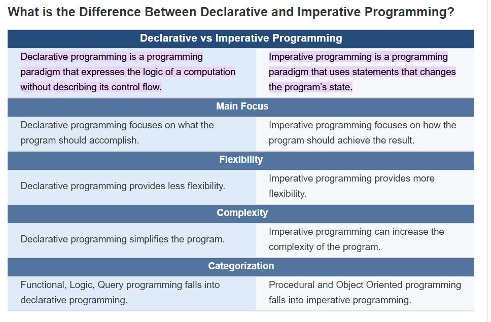

# contributors: 
1. Kambale Kibeho
.jpg)
2. Achiek Ayuen
  
3. Ahmed Abdi
   

  
  # DECLARATIVE AND IMPERATIVE PROGRAMMING
  ___
  ## Declarative Programming
  ___
  ### Definition
   ___

  Declarative programming is a method to abstract
away the control flow for logic required for 
to perform an action, and instead involves 
stating what the task or desired outcome is
declarative programming is a high-level 
     programming concept, which is the 
     opposite of imperative programming.

  ### example: 

  * const assert = require('chai').assert;

import {getNestedValue} from '../lib/objectProperties';

describe('getNestedValue()', () => {
    it('should return undefined for undefined objects', () =>
        assert.isUndefined(getNestedValue(undefined, 'foo'))
    );
    it('should return undefined for undefined properties', () =>
        assert.isUndefined(getNestedValue({}, 'foo'))
    );
    it('should return the named property if defined', () =>
        assert.equal(getNestedValue({bar: 'baz'}, 'bar'), 'baz')
    );
    it('should return the deeply nested named property if defined', () =>
        assert.equal(getNestedValue({bar: { baz: 1 }}, 'bar.baz'), 1)
    );
    it('should return undefined for a deeply nested named property if undefined', () =>
        assert.isUndefined(getNestedValue({}, 'bar.baz'))
    );
    it('should not accept to get empty property names', () =>
        assert.throws(() => getNestedValue({}, ''))
    )
});
  
  Examples of program using  Declarative are :

   * HTML,
   *  SQL,
   *   F#, 
   *   Prolog,

## Imperative Programming
  ___
  ### Definition

  It is a programming paradigm that uses statements that change a program's state. 
  In much the same way that the imperative mood in natural languages expresses commands, 
  an imperative program consists of commands for the computer to perform. Imperative programming focuses on describing how a program operates.

## Examples of programming languages that use Imperative programming

---
* Java 

* C 

* C++

example: 

export function getNestedValue(object, propertyName) {
    if (!propertyName) throw new Error('Impossible to set null property');
    var subObject = object,
        parts = propertyName.split('.'),
        len = parts.length,
        i;

    for (i = 0; i < len; i++) {
        if (!subObject || typeof subObject === 'undefined') return undefined;
        subObject = subObject[parts[i]];
    }

    return subObject;
}

