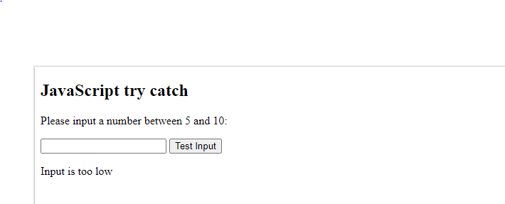

**HOW TO ThROW ABOUT AN ERROR**

The ***throw*** statement defines a custom error.  Allows you to modify an expected error.

for examples.

we have this error below and the solution given.

***First Example***

```
throw "Too big";    // throw a text
throw 500;          // throw a number`

```

***Second Example***

```
<!DOCTYPE html>
<html>
<body>

<h2>JavaScript try catch</h2>

<p>Please input a number between 5 and 10:</p>

<input id="demo" type="text">
<button type="button" onclick="myFunction()">Test Input</button>
<p id="p01"></p>

<script>
function myFunction() {
  const message = document.getElementById("p01");
  message.innerHTML = "";
  let x = document.getElementById("demo").value;
  try { 
    if(x == "")  throw "empty";
    if(isNaN(x)) throw "not a number";
    x = Number(x);
    if(x < 5)  throw "too low";
    if(x > 10)   throw "too high";
  }
  catch(err) {
    message.innerHTML = "Input is " + err;
  }
}
</script>

</body>
</html>

```


From the second example you will see the output will as below!



Once you enter a number that is not in between the ranger of 5 and 10 it will throw either too high when is above 10 and it will throw too low when is less than 5 while no number key in it will throw empty. 

When the number is in between the number range it not throw anything.
